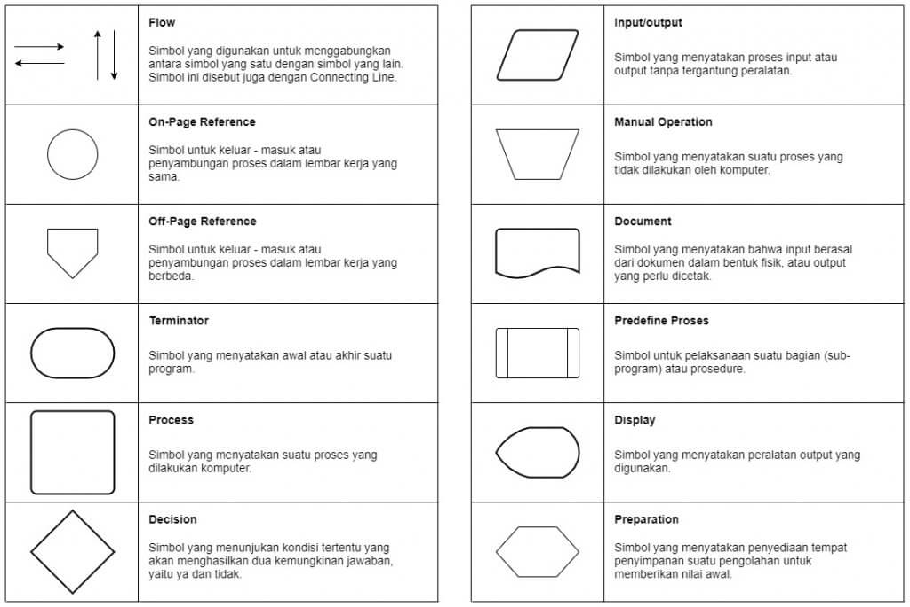
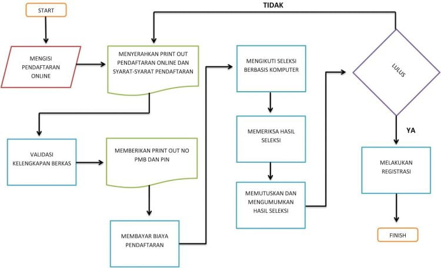

# Dokumentasi
Dokumentasi cara kerja dari API ini.

## Input

- **`string` flowchart** (nama key menggunakan nama shape) 
    - nama key menggunakan 1 atau 2 huruf awal dari referensi gambar diatas.
        | Key  | Meaning          |
        |------|----------------------|
        | ON   | On-Page Reference    |
        | OF   | Off-Page Reference   |
        | P    | Process              |
        | D    | Decision             |
        | IO   | Input/Output         |
        | MO   | Manual Operation     |
        | DC   | Document             |
        | PP   | Predefined Process   |
        | DS   | Display              |
        | PR   | Preparation          |

    - value / isi dari flow => "if < 2".

    - logic penamaan semua shape diberi angka urutan dan apabila ada decision/ loop maka diberi subnomor untuk penamaannya.

    - untuk `decision` ada 2 subnomor yang bisa digunakan
        - Dx.1 = hasil false
        - Dx.2 = hasil true

    - untuk child flow dari `false decision` harus diberikan subnomor dari decision false
        - P2.1.1 => membuat flow `process` pada decision 2 false untuk urutan pertama atau `process 1`
        - DC2.1.2 => membuat flow `document` pada decision 2 false untuk urutan kedua atau `document 2`

    - untuk mengimplementasikan `loop` atau penyambungan manual tambahakan notasi `=>{tujuan}`
        - `D3.1=>P2` = decision 3 false tersambung ke proses 2
        - `P2.1.1=>IO1` = flow `process 1` pada decision 2 false tersambung ke Input/Output 1

- **`bool` with_terminator**
    - value true/ false, bila maka awal akhir diberi notasi start/ end

### **contoh input endpoint:**

`with_terminator = true`

| Key  | Value                                                                 |
|------|-----------------------------------------------------------------------|
| IO1  | Mengisi pendaftaran online                                            |
| DC2  | Menyerahkan print out pendaftaran online dan syarat-syarat pendaftaran|
| P3   | Validasi kelengkapan berkas                                           |
| DC4  | Memberikan print out No PMB dan PIN                                   |
| P5   | Membayar biaya pendaftaran                                            |
| P6   | Mengikuti seleksi berbasis komputer                                   |
| P7   | Memeriksa hasil seleksi                                               |
| P8   | Memutuskan dan mengumumkan hasil seleksi                              |
| D9   | Lulus?                                                                |
| D9.1=>DC2 | Tidak                                                            |
| D9.2 | Ya                                                                    |
| P10  | Melakukan registrasi                                                  |

## Fungsionalitas
